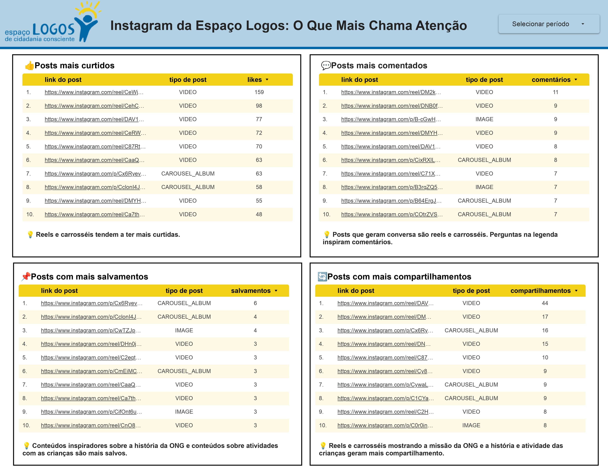
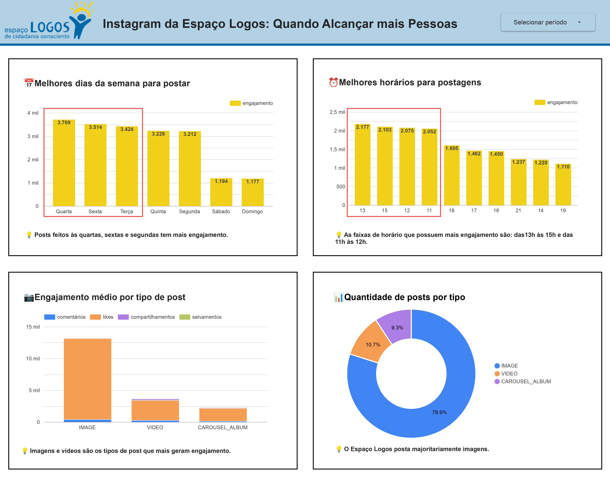

# Pipeline de Dados da Meta para Análise

Projeto desenvolvido para a ONG **Espaço Logos de Cidadania Consciente**, uma organização que promove projetos educativos, culturais e esportivos para crianças e jovens.  
Este repositório contém um ETL que coleta métricas do Instagram da ONG via **Instagram Graph API (Meta)**, salva os dados brutos no **Google Sheets** e alimenta dashboards no **Looker**, tudo automatizado com **GitHub Actions**.

---

## Sobre o Espaço Logos

O Espaço Logos de Cidadania Consciente atua na região da Tijuca (Rio de Janeiro) oferecendo oficinas de educação, cultura e esporte para crianças e jovens em situação de vulnerabilidade, com o objetivo de promover cidadania, cultura e protagonismo juvenil. [Clique aqui](https://espacologos.org.br/) para mais informações.

---

## Funcionamento do Projeto

1. **Coleta de Dados**  
   - Usa a **Instagram Graph API** para buscar todas as mídias do perfil da ONG.  
   - Campos coletados (exemplo): `id`, `caption`, `media_type`, `timestamp`, `permalink`, `like_count`, `comments_count`.

2. **Batch de Insights**  
   - Em lotes (até 50 IDs por requisição) busca `saved` e `shares` via endpoint `/insights?metric=saved,shares` para reduzir número de requisições e tempo.

3. **Armazenamento Raw**  
   - Insere os dados brutos (raw) em uma aba chamada `raw` no Google Sheets (via API).

4. **Automação**  
   - GitHub Actions executa o script por agendamento (cron).

5. **Visualização**  
   - Dados no Google Sheets são usados como fonte para dashboards no Looker.

---

## Visualização de Dados com o Looker Studio 

O dashboard é uma ferramenta prática para ajudar a gestora da ONG a visualizar os dados do Instagram sem complexidade técnica, identificar o que funciona melhor para a comunidade e tomar decisões simples para melhorar a presença digital e o engajamento orgânico do perfil. Foi desenvolvido pela ferramenta Looker Studio e tem duas páginas que mostram diferentes aspectos do desempenho dos posts no Instagram.

## Página 1 – O Que Mais Chama Atenção

Nesta página, temos os posts que mais tiveram reações do público, separados por quatro métricas importantes:
- Posts mais curtidos
- Posts mais comentados
- Posts com mais salvamentos
- Posts com mais compartilhamentos

Cada quadrante apresenta:

Uma tabela com os top posts para cada métrica, mostrando o tipo do post, o número de interações e o link direto para o Instagram.

Um pequeno insight em linguagem simples e direta, destacando o que foi percebido em cada grupo, como:
   - Reels e carrosséis tendem a ter mais curtidas.
   - Posts com perguntas na legenda geram mais comentários.
   - Conteúdos inspiradores e sobre atividades com crianças são os mais salvos.
   - Reels e carrosséis mostrando a missão da ONG são mais compartilhados.

## Página 2 – Quando Alcançar Mais Pessoas

Esta página ajuda a entender melhores momentos e tipos de post para aumentar o alcance e o engajamento:
   - Um gráfico de barras mostra quais dias da semana geram mais engajamento (curtidas + comentários). 
   - Um gráfico de barras indica as faixas de horário com maior engajamento. 
   - Gráfico mostrando o desempenho médio de curtidas, comentários, compartilhamentos e salvamentos para cada tipo de mídia (imagem, vídeo e carrossel). O insight:
   - Quantidade de posts por tipo

## Insights Gerais

+ Apostar em Reels e Carrosséis: esses formatos geram maior engajamento e são mais compartilhados, ajudando a ampliar o alcance da mensagem.
+ Publicar nos horários de maior engajamento: dias úteis no fim da manhã e início da tarde mostram maior interação, otimiza o impacto das postagens.
+ Conteúdos inspiradores e atividades com crianças são valorizados: aproveitar esses temas ajuda a aumentar o número de salvamentos e compartilhamentos, o que indica que são conteúdos que o público quer guardar e dividir.

---

## Ferramentas Utilizadas

| Python | Google Sheets | Looker | GitHub Actions |
| :----: | :-----------: | :----: | :------------: |
|  |  |  |  |
