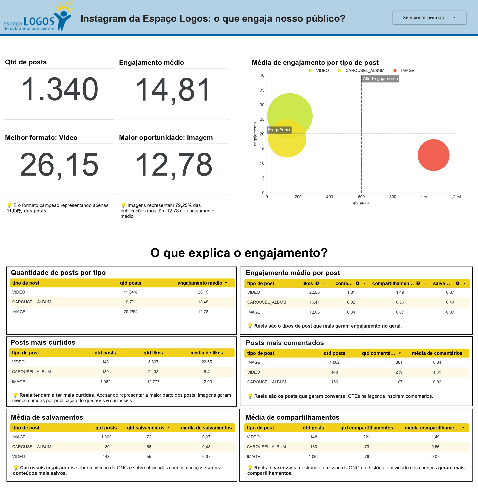
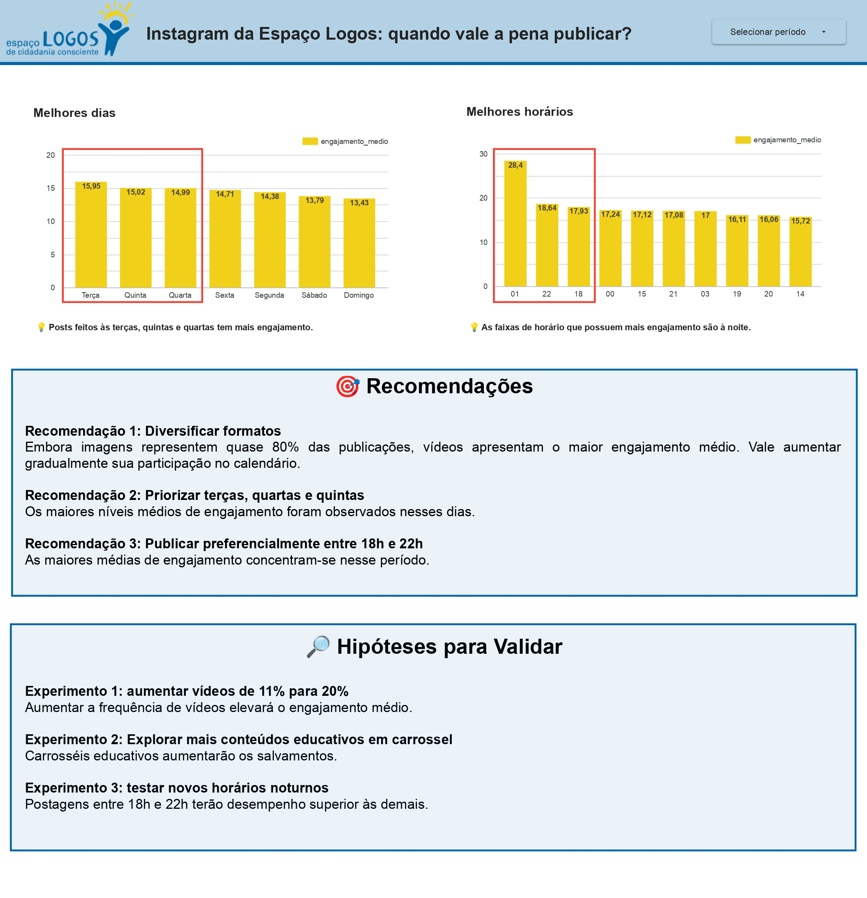

# Pipeline de Analytics do Instagram: Da API da Meta a Insights de Negócios

Projeto desenvolvido para a ONG **Espaço Logos de Cidadania Consciente**, organização que promove projetos educativos, culturais e esportivos para crianças e jovens.
O objetivo deste projeto foi responder uma pergunta simples: **Quais conteúdos geram mais engajamento no Instagram da ONG e quando vale a pena publicá-los?**

Para isso, foi desenvolvido um pipeline de dados que coleta métricas do Instagram via **Instagram Graph API (Meta)**, organiza os dados em uma camada analítica e alimenta dashboards no **Looker Studio**, permitindo que a gestora acompanhe o desempenho das publicações e tome decisões baseadas em dados.

---

## Sobre o Espaço Logos

O Espaço Logos de Cidadania Consciente atua na região da Tijuca (Rio de Janeiro) oferecendo oficinas de educação, cultura e esporte para crianças e jovens em situação de vulnerabilidade, com o objetivo de promover cidadania, cultura e protagonismo juvenil. [Clique aqui](https://espacologos.org.br/) para mais informações.

---

## Arquitetura do Projeto

1. **Coleta de Dados**  
   - Extração das publicações via Instagram Graph API.
   - Coleta de curtidas, comentários, tipo de mídia, data de publicação e permalink.

2. **Enriquecimento**  
   - Consulta em lote (batch) dos indicadores de salvamentos e compartilhamentos.

3. **Camada Raw**  
   - Armazenamento dos dados brutos em Google Sheets via API.

4. **Automação**  
   - Atualização automática semanal utilizando GitHub Actions.

5. **Camada Analítica**  
   - Organização dos dados para consumo pelo Looker Studio.

5. **Visualização**
   - Construção de dashboards orientados à tomada de decisão.
---

## Visualização de Dados com o Looker Studio 

O dashboard foi desenvolvido pensando em uma usuária não técnica. O objetivo era responder perguntas que ajudassem a ONG a melhorar sua estratégia de conteúdo.

## Página 1 – O que engaja nosso público?

A primeira página identifica quais conteúdos geram maior engajamento. As análises respondem perguntas como:
- Qual formato performa melhor?
- O volume de publicações acompanha o desempenho?
- Quais tipos de conteúdo recebem mais curtidas, comentários, salvamentos e compartilhamentos?

Além dos indicadores, cada seção apresenta um insight interpretando os resultados.

## Página 2 – Quando vale a pena publicar?

A segunda página transforma os resultados em recomendações práticas. Ela apresenta:
- melhores dias para publicação
- melhores horários
- recomendações priorizadas
- hipóteses para validação em ciclos futuros

Em vez de encerrar a análise no dashboard, o projeto propõe próximos experimentos para evolução contínua da estratégia de conteúdo.

## Principais Insights

+ Vídeos apresentam o maior engajamento médio, apesar de representarem uma pequena parcela das publicações.
+ Imagens concentram quase 80% do calendário editorial, mas possuem o menor engajamento médio.
+ Carrosséis apresentam maior média de salvamentos, indicando potencial para conteúdos educativos.
+ Terças, quartas e quintas concentram os maiores níveis médios de engajamento.
+ O período noturno apresentou melhor desempenho médio nas publicações analisadas.

---

## Ferramentas Utilizadas

| Python | Google Sheets | Looker Studio | GitHub Actions |
| :----: | :-----------: | :-----------: | :------------: |
|  |  |  |  |
